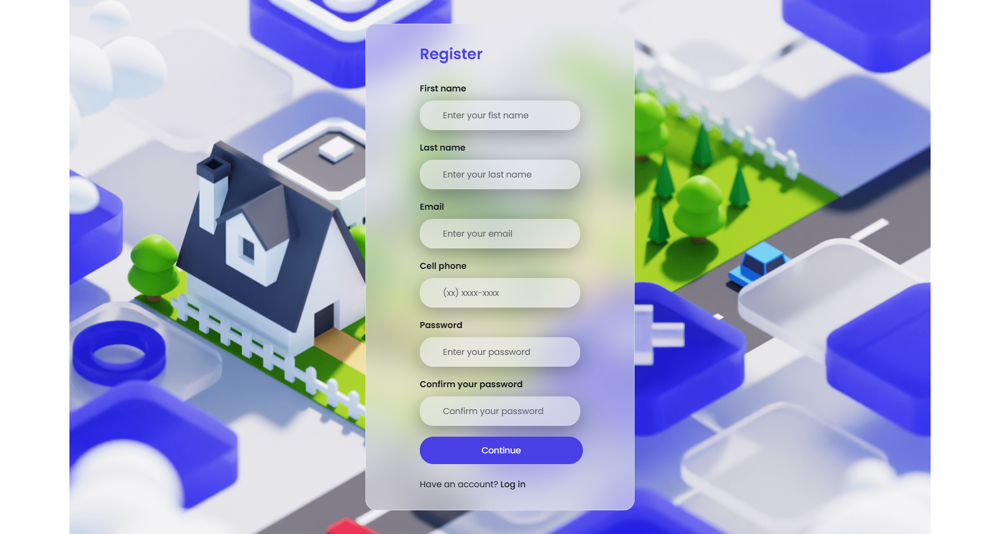

# Login 

Este projeto consiste em uma página de login e cadastro, utilizando os conceitos de Glassmorphism para um visual moderno e elegante. 
 

##  Página de login

##  Página de cadastro

##  Tecnologias Utilizadas:  
* HTML 
* CSS
* Javascript
  
 ## Versão Mobile
A versão mobile da página está em desenvolvimento, com adaptação para diferentes tamanhos de tela e melhorias na usabilidade.

  ## Funcionalidade do Cadeado
A função em JavaScript implementada permite que o usuário veja ou oculte a senha ao clicar no ícone do cadeado. Essa funcionalidade melhora a experiência do usuário, permitindo maior controle sobre o que é inserido no campo de senha.

 

 

##  Contato
claudiacostapaniago@gmail.com

